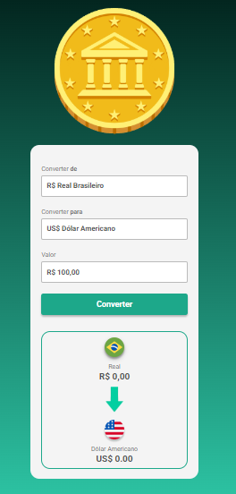

# Conversor de Moedas

Conversor de moedas feito com HTML, CSS e JavaScript. O usuário digita um valor em reais, escolhe a moeda de destino e vê o resultado convertido na tela, com a bandeira e o nome da moeda.

🔗 **[Testar o projeto online](https://conversor-de-moeda-alpha.vercel.app/)**



## Funcionalidades

- Conversão de Real (BRL) para Dólar Americano, Euro, Libra Esterlina e Bitcoin
- Troca automática da bandeira e do nome da moeda ao mudar o destino
- Formatação de valores por moeda com `Intl.NumberFormat` (R$, US$, €, £)
- Atualização do resultado ao clicar em **Converter** ou ao trocar a moeda de destino

## Tecnologias

- HTML5
- CSS3
- JavaScript (manipulação do DOM, eventos e `Intl.NumberFormat`)

## Como rodar

```bash
git clone https://github.com/fabriciabarbisan/CONVERSOR-DE-MOEDA.git
```

Abra o arquivo `index.html` no navegador (ou use a extensão Live Server do VS Code).

## Observações

- As cotações são valores fixos definidos no arquivo `scripts.js`; o projeto não consulta uma API de cotações em tempo real.
- Este é um projeto de estudo do curso de Desenvolvimento Web do DevClub.

## Estrutura

```
├── index.html
├── style.css
├── scripts.js
└── img/
```

## Demo

Projeto publicado na Vercel: [conversor-de-moeda-alpha.vercel.app](https://conversor-de-moeda-alpha.vercel.app/)
